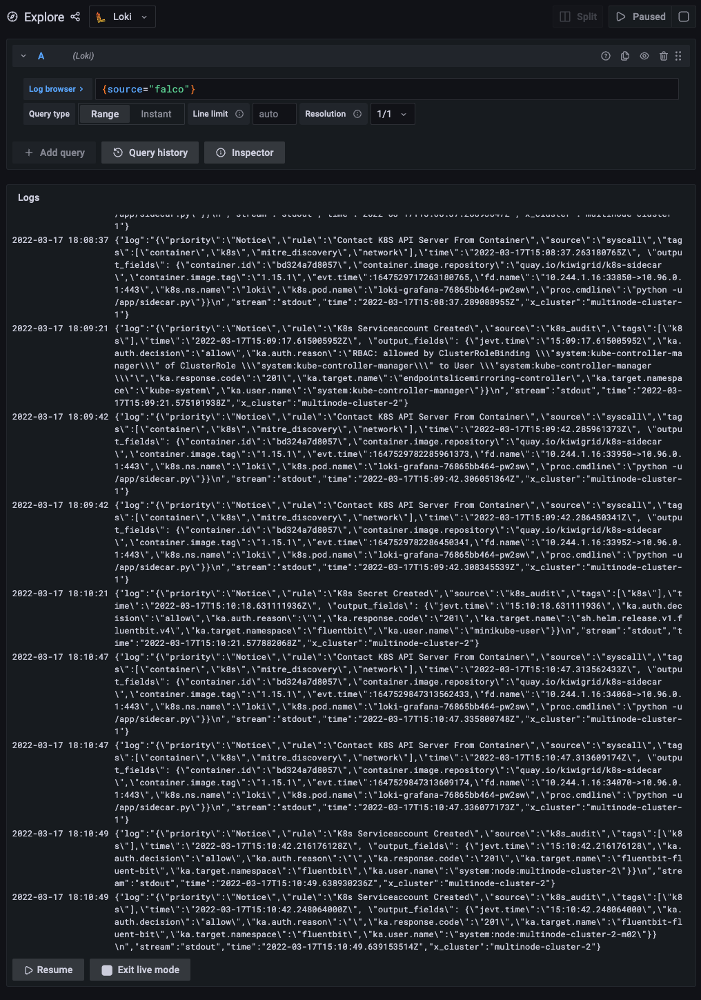

# Threat Hunting at Scale: Auditing Thousands of Clusters With Falco + Fluent

Authors: Emin Aktaş, Furkan Türkal

At Trendyol, we are running production-grade Kubernetes clusters to make our customers always happy. The challenge that we have to achieve is to track every component, resource, user, and team in a timeline manner. This is where we have to collect audit events from almost everywhere! Kubernetes audit logs can effectively track the changes made to our clusters. By using Falco, we consume the kernel events and enrich those events with information from Kubernetes. Enabling Kubernetes Audit Logs feature allows us to scan audit events that forwarded from Kubernetes. By using Fluent Bit, we collect logs from different sources such as containers and Falco; furthermore, we extend them with filters, and send them to multiple destinations. By using Loki, we build a highly-available log aggregation system. We create and manage all of our alerting rules for the log data. In this session, we try to combine pieces and introduce a brand new Audit Monitoring System!

## Create an environment

For you to create the same experience, we will create a cluster with `minikube`. If you don't know how you can install minikube, go to this [link](https://minikube.sigs.k8s.io/docs/start/) for installation.

```bash
$ export CLUSTER_1=multinode-cluster-1
# Let's deploy clusters
$ minikube start --kubernetes-version=v1.23.4 --nodes 2 -p $CLUSTER_1 --cpus 2 --memory 4096 --driver virtualbox
$ export CLUSTER_2=multinode-cluster-2
$ minikube start --kubernetes-version=v1.23.4 --nodes 2 -p $CLUSTER_2 --cpus 2 --memory 4096 --driver virtualbox
```

### Enable K8s audit

Following steps should be applied in the minikube so `minikube ssh -p <profile-name>` to access to VM or container.

```bash
# Accesing our deployed clusters
$ minikube ssh -p $CLUSTER_1
$ minikube ssh -p $CLUSTER_2
```

```bash
# Create a folder for audit polcy and audits
$ sudo mkdir -p /var/log/kubernetes/audit/
# Default audit policies provided by Kubernetes. Ref: https://kubernetes.io/docs/tasks/debug-application-cluster/audit/#audit-policy
$ sudo curl -o /etc/kubernetes/audit-policy.yaml https://raw.githubusercontent.com/kubernetes/website/main/content/en/examples/audit/audit-policy.yaml
```

Mount the audit directory and `audit-policy.yaml` file to apiserver since it is running as container.

```bash
# Start editing kube-apiserver
$ sudo vi /etc/kubernetes/manifests/kube-apiserver.yaml
```

```yaml
...
    volumeMounts:
    - mountPath: /etc/kubernetes/audit-policy.yaml
      name: audit
      readOnly: true
    - mountPath: /var/log/kubernetes/audit/
      name: audit-log
      readOnly: false
```

Configure `hostPath`.

```yaml
...
  volumes:
  - name: audit
    hostPath:
      path: /etc/kubernetes/audit-policy.yaml
      type: File
  - name: audit-log
    hostPath:
      path: /var/log/kubernetes/audit/
      type: DirectoryOrCreate
```

Add the following parameters to activate log backend.

```yaml
    - --audit-policy-file=/etc/kubernetes/audit-policy.yaml
    - --audit-log-path=/var/log/kubernetes/audit/audit.log
```

You can check out this complated sample `kube-apiserver.yaml` file [here](minikube/sample-kube-apiserver.yaml).

When you save the changes, kube-apiserver will automatically restart. We can now see the audit logs in `/var/log/kubernetes/audit/` directory.

```bash
# tail outputs the last part of files, and keeps printing with -f flag 
$ tail /var/log/kubernetes/audit/audit.log -f
{"kind":"Event","apiVersion":"audit.k8s.io/v1","level":"Request","auditID":"8b0f9afd-2962-49e5-ad1b-d51caf27d573","stage":"ResponseComplete","requestURI":"/api/v1/namespaces/default/endpoints/kubernetes","verb":"get","user":{"username":"system:apiserver","uid":"fb486d21-e55e-4141-aaf5-3acc12a39e3f","groups":["system:masters"]},"sourceIPs":["127.0.0.1"],"userAgent":"kube-apiserver/v1.20.7 (linux/amd64) kubernetes/132a687","objectRef":{"resource":"endpoints","namespace":"default","name":"kubernetes","apiVersion":"v1"},"responseStatus":{"metadata":{},"code":200},"requestReceivedTimestamp":"2022-03-16T19:23:20.812664Z","stageTimestamp":"2022-03-16T19:23:20.814048Z","annotations":{"authorization.k8s.io/decision":"allow","authorization.k8s.io/reason":""}}
...
```

Let's register the cluster ips

```bash
# export cluster ips
$ export CLUSTER_1_IP=$(minikube ip -p $CLUSTER_1)
$ export CLUSTER_2_IP=$(minikube ip -p $CLUSTER_2)
```

### Install Fluentbit

Apply the following commands for `multinode-cluster-1` and `multinode-cluster-2`.

```bash
# Generate values.yaml with the cluster name, so we can know where the logs are coming.
$ K8S_CLUSTER=$CLUSTER_1 envsubst < fluentbit/template-values.yaml > fluentbit/generated-values.yaml
# Run following commands to install fluentbit
$ helm repo add fluent https://fluent.github.io/helm-charts
$ helm repo update
$ helm --kube-context=$CLUSTER_1 upgrade --install fluentbit fluent/fluent-bit \
  -f fluentbit/output-values.yaml \
  -f fluentbit/generated-values.yaml \
  -n fluentbit \
  --create-namespace \
  --version 0.19.20
# Repeat it for second cluster
$ K8S_CLUSTER=$CLUSTER_2 envsubst < fluentbit/template-values.yaml > fluentbit/generated-values.yaml
$ helm --kube-context=$CLUSTER_2 upgrade --install fluentbit fluent/fluent-bit \
  -f fluentbit/output-values.yaml \
  -f fluentbit/generated-values.yaml \
  -n fluentbit \
  --create-namespace \
  --version 0.19.20
```

## Install Falco

Install Falco for both clusters.

```bash
$ helm repo add falcosecurity https://falcosecurity.github.io/charts
$ helm repo update
$ helm --kube-context=$CLUSTER_1 upgrade --install falco falcosecurity/falco \
  -f falco/values.yaml \
  -n falco \
  --create-namespace \
  --version 1.17.3
$ helm --kube-context=$CLUSTER_2 upgrade --install falco falcosecurity/falco \
  -f falco/values.yaml \
  -n falco \
  --create-namespace \
  --version 1.17.3
```

## Install Loki

With loki-stack, we are installing loki and grafana. It is enough to install a Loki and a Grafana. We will be sending outputs in the same Loki.

```bash
$ helm repo add grafana https://grafana.github.io/helm-charts
$ helm repo update
$ helm --kube-context=$CLUSTER_1 upgrade --install loki grafana/loki-stack \
  -f loki/values.yaml \
  --namespace=loki \
  --create-namespace \
  --version 2.6.1
```

```bash
# Get user and password information
$ kubectl --context=$CLUSTER_1 get secret -n loki loki-grafana -o jsonpath='{.data.admin-user}' | base64 -d
$ kubectl --context=$CLUSTER_1 get secret -n loki loki-grafana -o jsonpath='{.data.admin-password}' | base64 -d
```

## Guide your second cluster auidts

We will be creating a service for our second cluster to find correct endpoint. This is going to be done on the second cluster since we want to direct auidts to our Loki in the other cluster.

```bash
# Create a namespace
$ kubectl --context=$CLUSTER_2 create namespace loki
# or $CLUSTER_2_IP. Depends where you installed loki
$ export CLUSTER_1_IP=$(minikube ip -p $CLUSTER_1)
$ LOKI_IP=$CLUSTER_1_IP envsubst < minikube/template-loki-endpoint.yaml > minikube/generated-loki-endpoint.yaml
# or $CLUSTER_1. Depends where you didn't install loki
# Create Loki service
$ kubectl --context=$CLUSTER_2 apply -f minikube/loki-service.yaml
# Create Loki endpoint
$ kubectl --context=$CLUSTER_2 apply -f minikube/generated-loki-endpoint.yaml
```

The result is you now have a working system.

```bash
# Enter the profile name where you installed grafana.
$ minikube ip -p $CLUSTER_1 # or $CLUSTER_2. Depends where you installed loki
# or
$ echo $CLUSTER_1_IP # or $CLUSTER_2. Depends where you installed loki
```

`<cluster-ip>:31300 is the address for grafana`


